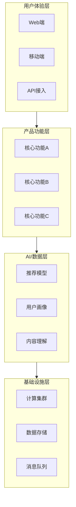
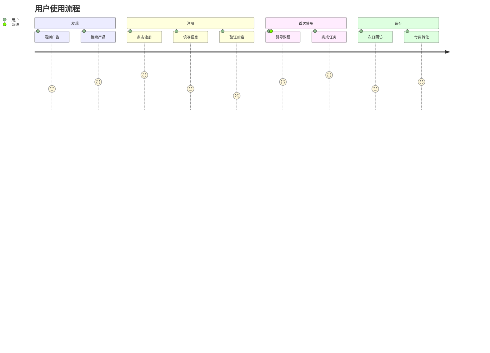
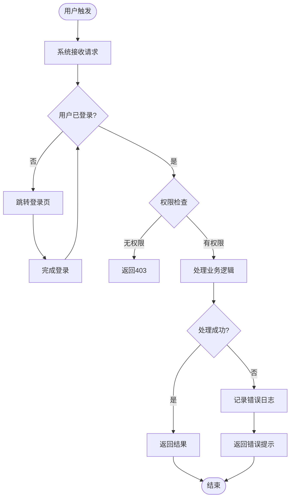
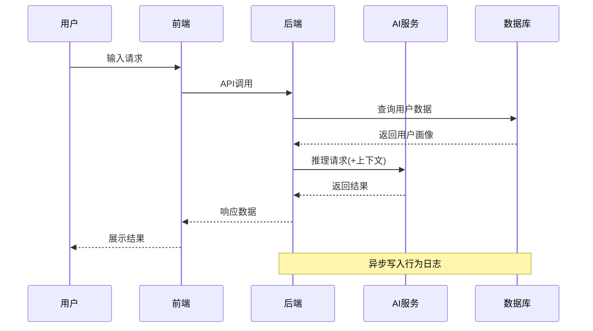
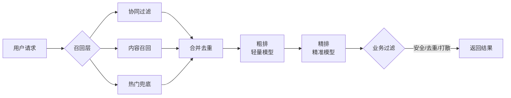
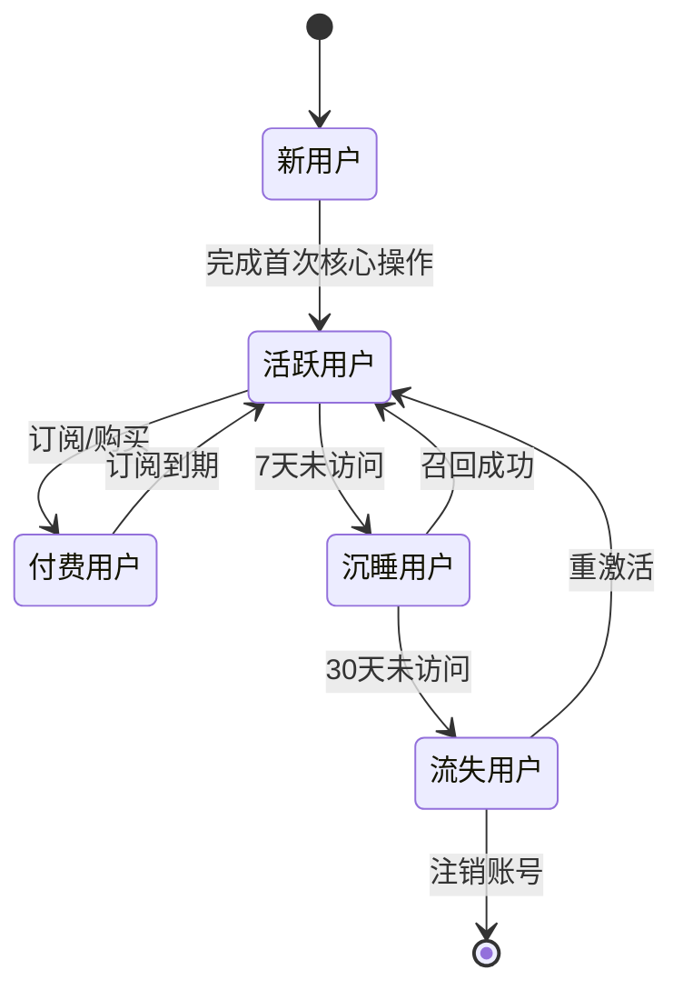
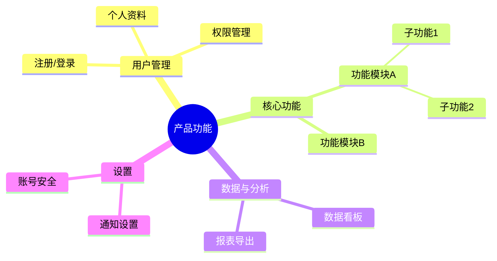
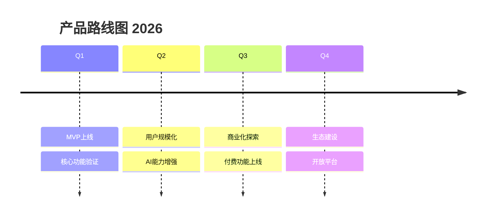

# Mermaid 图模式库

产品经理常用图的完整示例代码。

---

## 1. 产品架构图（分层）

---

## 2. 用户旅程图

---

## 3. 业务流程图（带判断）

---

## 4. 系统交互时序图

---

## 5. 推荐系统策略流程图

---

## 6. 用户状态机

---

## 7. 功能脑图

---

## 8. 产品时间线（Roadmap）

